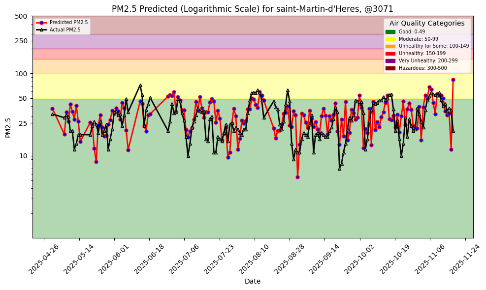
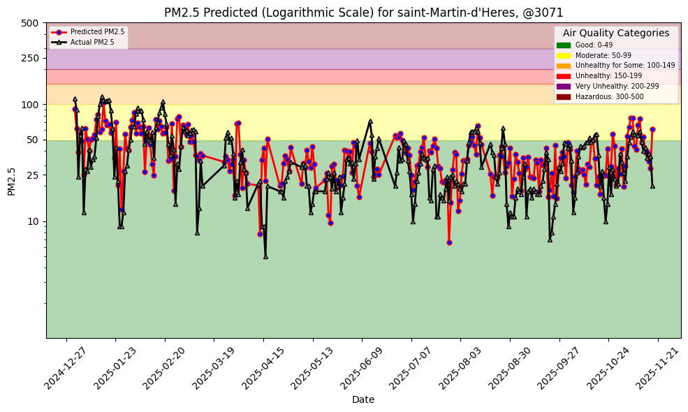
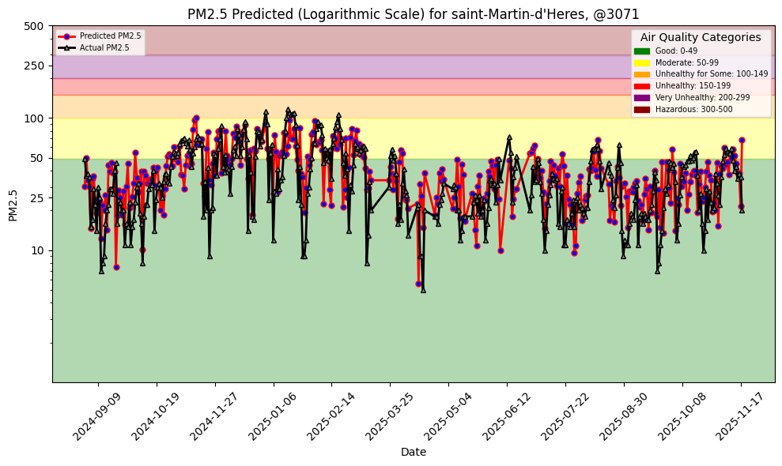

## Air quality project

The project is a fork from https://github.com/featurestorebook/mlfs-book

A lot of commits have been erased because I tried to do a push --force when git was broken about an hour ago (yes I panicked).

To sum up the commits that can't be seen, here is what we did : 
- running the 4 first notebooks.
- setting up a daily workflow with github actions and a dashboard with pages.
- Tried different location because we thought that a negative r-squared was exceptionnaly bad, so we thought our sensors were broken (we no longer think that).
- changed the sensor to this one.
- adding 3 features corresponding to the lag pm25 for 3 days, then for one day.

## Beginning

The first modifications were to change the .env and to put my personal API keys, to change the csv file with a sensor located in Saint-Martin-d'Hères, France (location of my former school, ENSIMAG).

After that, I run the notebooks as they were and logged the performance of the model.

MSE: 213.83423
R squared: -0.06340524613581633

I think the model is not very good, but it is comprehensible since we have a few features, and that air quality could not be explained by only these features.

## Improving the model

We can think of improving the model by :
- Adjusting the ratio of test/training dataset.
- Doing some feature engineering.
- Fine tune the model.
- Adding auto-regression (later).

### Increasing the ratio train/test set

In our first way of improving the model, let's adjust the ratio of test/training dataset.
The current ratio is 176/1826 which is 10 %

Let's see what happens if we increase it to 15 %
So I changed the date of the frontier to 2025-01-01, we have now : 

MSE: 310.94174
R squared: 0.385145135232303

Higher MSE but higher R squared, so it is difficult to conclude
 

By seeing this plot we can be satisfied, the predictions seems to be better, but before the other point, let's increase the ratio to 25%
I changed the frontier to 2024-09-01

MSE: 290.2019
R squared: 0.40544789044128504

That is quite better, 

The dataset is very small (2000 rows) so maybe a higher ratio would be better.

Here is the metrics for a ratio of 34%
MSE: 260.80862
R squared: 0.41135491104827304

The tendancy is that when the ratio increases, the accuracy increases, but at a certain extent. Here, I decided that it was good like that. Let's keep it and move on to the next point

## Feature engineering

Currently, we have 4 weather features : 'temperature_2m_mean' , 'wind_direction_10m_dominant', 'wind_speed_10m_max', 'precipitation_sum'

I've tried to add weather features like 'sunshine duration', 'daylight duration' etc. but it needs to be accorded with the hourly forecast in the second notebook. Since it is painful to add historical weather feature making sure that we can retrieves it from a forecast, we decided not to do that.

However, what we wanted to add was not that correlated with PM25 as the correlation matrix shows 

### To improve the model, we could try extracting new features from these, to maximize the correlation.

It takes to test the perfect combination so let's move on.

## Fine tune the model.

As our target depend on the date, it will be non productive to do a basic KFold cross validation. 

A simple GridSearchCV to fine tune the parameter of the tree has improved the accuracy of the model. It is now at :

MSE: 229.48044
R squared: 0.4820626479515786

