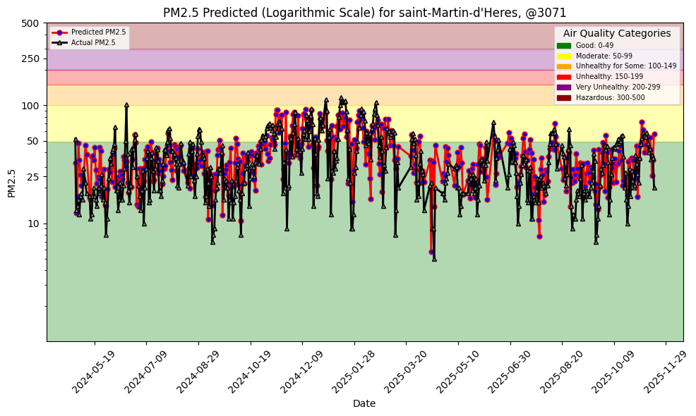
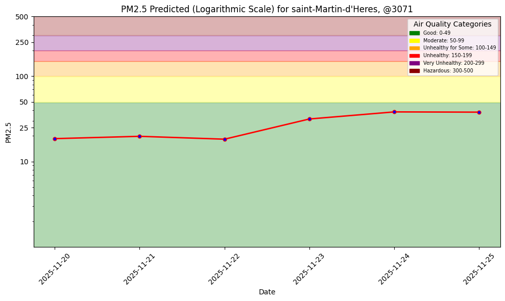
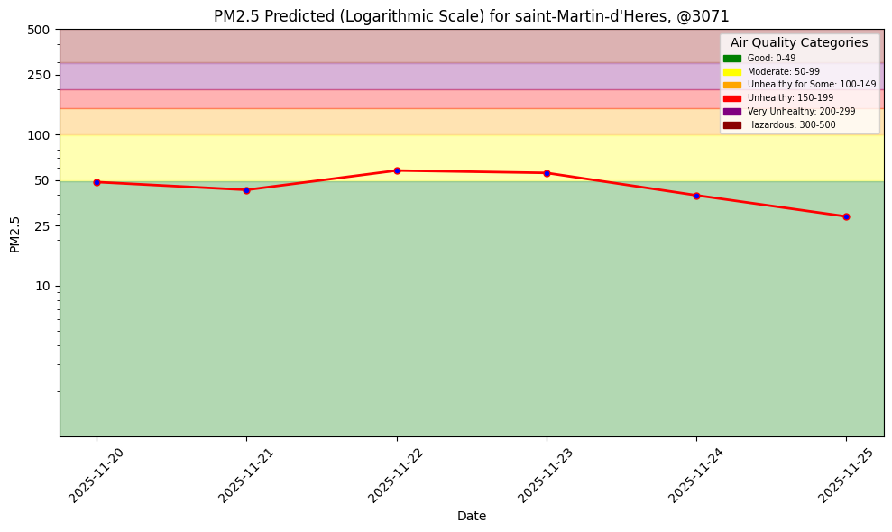
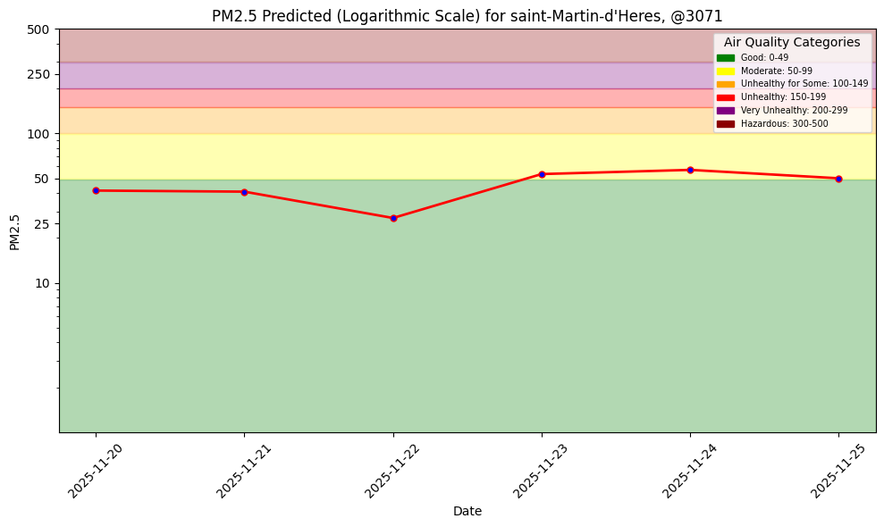
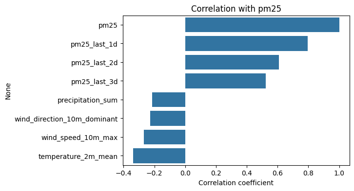

## Air quality project

(Fork of https://github.com/featurestorebook/mlfs-book)

A lot of commits have been erased because I tried to do a push --force when git was broken.

To sum up the commits that can't be seen, here is what we did : 
- running the 4 first notebooks.
- setting up a daily workflow with github actions and a dashboard with pages.
- Tried different location because we thought that a negative r-squared was exceptionnaly bad, so we thought our sensors were broken.
- changed the sensor to this one.
- adding 3 features corresponding to the lag pm25 for 3 days, then for one day.

## Beginning

The first modifications were to change the .env and to put my personal API keys and to change the csv file with a sensor located in Saint-Martin-d'Hères, France (location of my former school, ENSIMAG).

After that, I ran the notebooks as they were and logged the performance of the model.

MSE: 213.8

R squared: -0.06

I think the model is not very good, but it is comprehensible since we have a few features, and that air quality could not be explained by only these features.

## Improving the model

We can think of improving the model by :
- Adjusting the ratio of test/training dataset.
- Doing some feature engineering.
- Fine tune the model.
- Adding auto-regression (later).

### Increasing the ratio train/test set

In our first way of improving the model, let's adjust the ratio of test/training dataset.
The current ratio is 176/1826 which is 10 %

Let's see what happens if we increase it to 15 %
So I changed the date of the frontier to 2025-01-01, we have now : 

MSE: 310.9

R squared: 0.385

Higher MSE but higher R squared, so it is difficult to conclude
 

By seeing this plot we can be satisfied, the predictions seems to be slightly better, but before the other point, let's increase the ratio to 25%.

I changed the frontier to 2024-09-01

MSE: 290.2

R squared: 0.405

That is quite better, 

The dataset is very small (2000 rows) so maybe a higher ratio would be better.

Here is the metrics for a ratio of 34%

MSE: 260.8

R squared: 0.411

The tendancy is that when the ratio increases, the accuracy increases, but at a certain extent. Here, I decided that it was good like that. Let's keep it and move on to the next point

## Feature engineering

Currently, we have 4 weather features : 'temperature_2m_mean' , 'wind_direction_10m_dominant', 'wind_speed_10m_max', 'precipitation_sum'

I've tried to add weather features like 'sunshine duration', 'daylight duration' etc. but it needs to be accorded with the hourly forecast in the second notebook. Since it is painful to add historical weather feature making sure that we can retrieves it from a forecast, we decided not to do that.

However, what we wanted to add was not that correlated with PM25 as the correlation matrix shows 

### To improve the model, we could try extracting new features from these, to maximize the correlation.

It takes time to test the perfect combination so let's move on.

## Fine tune the model.

As our target depend on the date, it will be non productive to do a basic KFold cross validation. 

A simple GridSearchCV to fine tune the parameter of the tree has improved the accuracy of the model. It is now at :

MSE: 229.5

R squared: 0.48

## Auto-regression

The last thing is Auto-regression which is required for grade C. To do so, we need to add 3 features that corresponds to the PM25 of the last 3 days. It will be complicated because we can't do a request to get pm25 of the last days from the API. So we have to get it from the feature group and deal with the case of missing values.

Before doing that, the positive points of auto-regression is that it will improve the accuracy of the model because the PM25 of the last days is highly correlated with the one of today.

However, the problem of doing that come in prediction. Because we have no choice but to use predicted PM25 as feature to predict new PM25. It is risky because errors would propagate.

Using more days for windowing increases this risk as more errors will propagate.

First, let's see the chart of the predictions for the next days with our model without windowing

So how to implement windowing. For the backfill, I sorted the dataframe according to the date and then did a shifting with forward filling. Same thing when retrieving daily feature, we've added a method called "get_pm25_last_k_days" that retrieves the PM25 of the last k days, by setting the date as index, paying attention to fill na values with forward filling.

### Score with 1 day windowing

MSE: 95.67297
R squared: 0.7838688225921453

A big improve, this is explained by the high correlation between the new feature and the target. 

To implement windowing for inference, instead of predicting all the pm25 at once, iterations are needed to fill every lag feature with the one that has been predicted before.

Predictions for a one day windowing

### Score with 2 day windowing

MSE: 93.14161
R squared: 0.7895873168681785

There is a very slight to no improve from 1 day to 2 day windowing, even if PM25 of 2 days ago is highly correlated with the PM25 of today. That is because all the information carried by the PM25 of 2 days ago is also carried by the PM25 of yesterday.

Predictions for a two day monitoring

### Score with 3 day windowing

MSE: 94.039116
R squared: 0.7875598061796693

Predictions for a three day monitoring

The observations differ when implementing auto-regression or not. They also differ between a window of 1 day or more.

We can't say directly what model will predict the best, we need to wait the real values before. 
However, we can see that the performance of the trained model is higher with auto-regression than without. But it is almost the same whether for one, two or three added features. 

So we can conclude that adding only one lag feature is sufficient since more features does not improve significantly the accuracy of the model. The biggest correlation is provided by the first lag feature as it is shown here.
(workflow)

## Workflow and dashboard

A daily workflow is set using github actions and a dashboard is accessible with the following link https://samyzouggari.github.io/mlfs-book/air-quality/